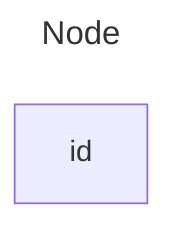
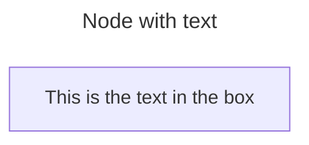
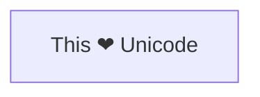
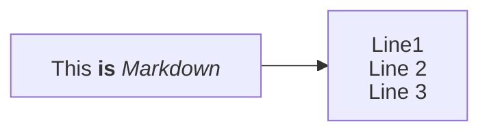
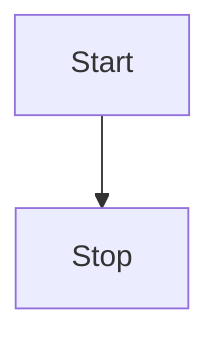
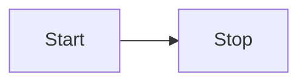
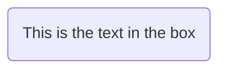
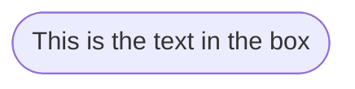
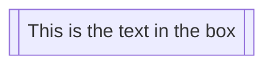
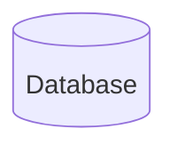

Title: Live Content

Description: Fetched live

Source: https://raw.githubusercontent.com/mermaid-js/mermaid/develop/docs/syntax/flowchart.md

---

> **Warning**
>
> ## THIS IS AN AUTOGENERATED FILE. DO NOT EDIT.
>
> ## Please edit the corresponding file in [/packages/mermaid/src/docs/syntax/flowchart.md](../../packages/mermaid/src/docs/syntax/flowchart.md).

# Flowcharts - Basic Syntax

Flowcharts are composed of **nodes** (geometric shapes) and **edges** (arrows or lines). The Mermaid code defines how nodes and edges are made and accommodates different arrow types, multi-directional arrows, and any linking to and from subgraphs.

> **Warning**
> If you are using the word "end" in a Flowchart node, capitalize the entire word or any of the letters (e.g., "End" or "END"), or apply this [workaround](https://github.com/mermaid-js/mermaid/issues/1444#issuecomment-639528897). Typing "end" in all lowercase letters will break the Flowchart.

> **Warning**
> If you are using the letter "o" or "x" as the first letter in a connecting Flowchart node, add a space before the letter or capitalize the letter (e.g., "dev--- ops", "dev---Ops").
>
> Typing "A---oB" will create a [circle edge](#circle-edge-example).
>
> Typing "A---xB" will create a [cross edge](#cross-edge-example).

### A node (default)




> **Note**
> The id is what is displayed in the box.

> **💡 Tip**
> Instead of `flowchart` one can also use `graph`.

### A node with text

It is also possible to set text in the box that differs from the id. If this is done several times, it is the last text
found for the node that will be used. Also if you define edges for the node later on, you can omit text definitions. The
one previously defined will be used when rendering the box.




#### Unicode text

Use `"` to enclose the unicode text.




#### Markdown formatting

Use double quotes and backticks "\` text \`" to enclose the markdown text.




### Direction

This statement declares the direction of the Flowchart.

This declares the flowchart is oriented from top to bottom (`TD` or `TB`).




This declares the flowchart is oriented from left to right (`LR`).




Possible FlowChart orientations are:

- TB - Top to bottom
- TD - Top-down/ same as top to bottom
- BT - Bottom to top
- RL - Right to left
- LR - Left to right

## Node shapes

### A node with round edges




### A stadium-shaped node




### A node in a subroutine shape




### A node in a cylindrical shape




### A node in the form of a circle

```mermaid-example
flowchart LR
    id1((This is the text in the circle))
```

```mermaid
flowchart LR
    id1((This is the text in the circle))
```

### A node in an asymmetric shape

```mermaid-example
flowchart LR
    id1>This is the text in the box]
```

```mermaid
flowchart LR
    id1>This is the text in the box]
```

Currently only the shape above is possible and not its mirror. _This might change with future releases._

### A node (rhombus)

```mermaid-example
flowchart LR
    id1{This is the text in the box}
```

```mermaid
flowchart LR
    id1{This is the text in the box}
```

### A hexagon node

```mermaid-example
flowchart LR
    id1{{This is the text in the box}}
```

```mermaid
flowchart LR
    id1{{This is the text in the box}}
```

### Parallelogram

```mermaid-example
flowchart TD
    id1[/This is the text in the box/]
```

```mermaid
flowchart TD
    id1[/This is the text in the box/]
```

### Parallelogram alt

```mermaid-example
flowchart TD
    id1[\This is the text in the box\]
```

```mermaid
flowchart TD
    id1[\This is the text in the box\]
```

### Trapezoid

```mermaid-example
flowchart TD
    A[/Christmas\]
```

```mermaid
flowchart TD
    A[/Christmas\]
```

### Trapezoid alt

```mermaid-example
flowchart TD
    B[\Go shopping/]
```

```mermaid
flowchart TD
    B[\Go shopping/]
```

### Double circle

```mermaid-example
flowchart TD
    id1(((This is the text in the circle)))
```

```mermaid
flowchart TD
    id1(((This is the text in the circle)))
```

## Expanded Node Shapes in Mermaid Flowcharts (v11.3.0+)

Mermaid introduces 30 new shapes to enhance the flexibility and precision of flowchart creation. These new shapes provide more options to represent processes, decisions, events, data storage visually, and other elements within your flowcharts, improving clarity and semantic meaning.

New Syntax for Shape Definition

Mermaid now supports a general syntax for defining shape types to accommodate the growing number of shapes. This syntax allows you to assign specific shapes to nodes using a clear and flexible format:

```
A@{ shape: rect }
```

This syntax creates a node A as a rectangle. It renders in the same way as `A["A"]`, or `A`.

### Complete List of New Shapes

Below is a comprehensive list of the newly introduced shapes and their corresponding semantic meanings, short names, and aliases:

| **Semantic Name**                 | **Shape Name**         | **Short Name** | **Description**                | **Alias Supported**                                              |
| --------------------------------- | ---------------------- | -------------- | ------------------------------ | ---------------------------------------------------------------- |
| Bang                              | Bang                   | `bang`         | Bang                           | `bang`                                                           |
| Card                              | Notched Rectangle      | `notch-rect`   | Represents a card              | `card`, `notched-rectangle`                                      |
| Cloud                             | Cloud                  | `cloud`        | cloud                          | `cloud`                                                          |
| Collate                           | Hourglass              | `hourglass`    | Represents a collate operation | `collate`, `hourglass`                                           |
| Com Link                          | Lightning Bolt         | `bolt`         | Communication link             | `com-link`, `lightning-bolt`                                     |
| Comment                           | Curly Brace            | `brace`        | Adds a comment                 | `brace-l`, `comment`                                             |
| Comment Right                     | Curly Brace            | `brace-r`      | Adds a comment                 |                                                                  |
| Comment with braces on both sides | Curly Braces           | `braces`       | Adds a comment                 |                                                                  |
| Data Input/Output                 | Lean Right             | `lean-r`       | Represents input or output     | `in-out`, `lean-right`                                           |
| Data Input/Output                 | Lean Left              | `lean-l`       | Represents output or input     | `lean-left`, `out-in`                                            |
| Data Store                        | Data Store             | `datastore`    | Data flow diagram data store   | `data-store`                                                     |
| Database                          | Cylinder               | `cyl`          | Database storage               | `cylinder`, `database`, `db`                                     |
| Decision                          | Diamond                | `diam`         | Decision-making step           | `decision`, `diamond`, `question`                                |
| Delay                             | Half-Rounded Rectangle | `delay`        | Represents a delay             | `half-rounded-rectangle`                                         |
| Direct Access Storage             | Horizontal Cylinder    | `h-cyl`        | Direct access storage          | `das`, `horizontal-cylinder`                                     |
| Disk Storage                      | Lined Cylinder         | `lin-cyl`      | Disk storage                   | `disk`, `lined-cylinder`                                         |
| Display                           | Curved Trapezoid       | `curv-trap`    | Represents a display           | `curved-trapezoid`, `display`                                    |
| Divided Process                   | Divided Rectangle      | `div-rect`     | Divided process shape          | `div-proc`, `divided-process`, `divided-rectangle`               |
| Document                          | Document               | `doc`          | Represents a document          | `doc`, `document`                                                |
| Event                             | Rounded Rectangle      | `rounded`      | Represents an event            | `event`                                                          |
| Extract                           | Triangle               | `tri`          | Extraction process             | `extract`, `triangle`                                            |
| Fork/Join                         | Filled Rectangle       | `fork`         | Fork or join in process flow   | `join`                                                           |
| Internal Storage                  | Window Pane            | `win-pane`     | Internal storage               | `internal-storage`, `window-pane`                                |
| Junction                          | Filled Circle          | `f-circ`       | Junction point                 | `filled-circle`, `junction`                                      |
| Lined Document                    | Lined Document         | `lin-doc`      | Lined document                 | `lined-document`                                                 |
| Lined/Shaded Process              | Lined Rectangle        | `lin-rect`     | Lined process shape            | `lin-proc`, `lined-process`, `lined-rectangle`, `shaded-process` |
| Loop Limit                        | Trapezoidal Pentagon   | `notch-pent`   | Loop limit step                | `loop-limit`, `notched-pentagon`                                 |
| Manual File                       | Flipped Triangle       | `flip-tri`     | Manual file operation          | `flipped-triangle`, `manual-file`                                |
| Manual Input                      | Sloped Rectangle       | `sl-rect`      | Manual input step              | `manual-input`, `sloped-rectangle`                               |
| Manual Operation                  | Trapezoid Base Top     | `trap-t`       | Represents a manual task       | `inv-trapezoid`, `manual`, `trapezoid-top`                       |
| Multi-Document                    | Stacked Document       | `docs`         | Multiple documents             | `documents`, `st-doc`, `stacked-document`                        |
| Multi-Process                     | Stacked Rectangle      | `st-rect`      | Multiple processes             | `processes`, `procs`, `stacked-rectangle`                        |
| Odd                               | Odd                    | `odd`          | Odd shape                      |                                                                  |
| Paper Tape                        | Flag                   | `flag`         | Paper tape                     | `paper-tape`                                                     |
| Prepare Conditional               | Hexagon                | `hex`          | Preparation or condition step  | `hexagon`, `prepare`                                             |
| Priority Action                   | Trapezoid Base Bottom  | `trap-b`       | Priority action                | `priority`, `trapezoid`, `trapezoid-bottom`                      |
| 

